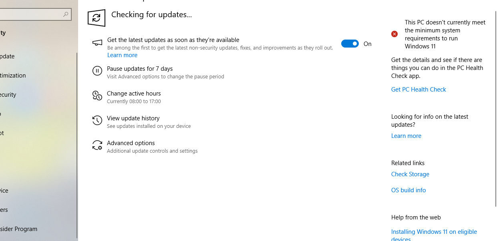
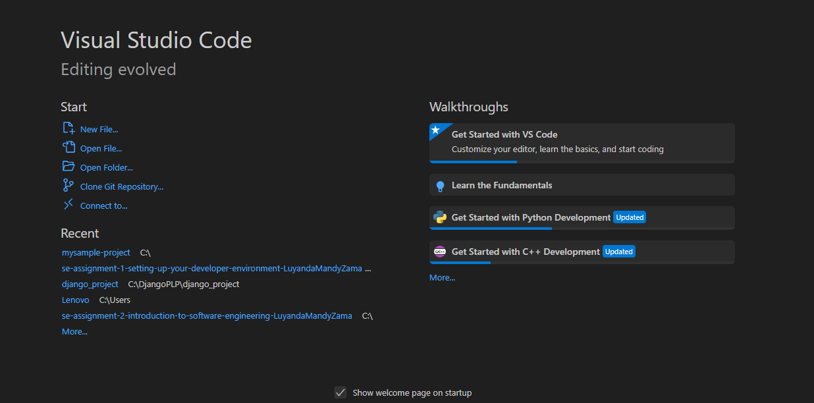
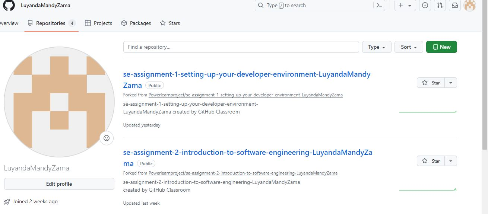
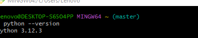
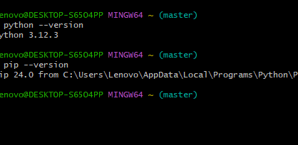
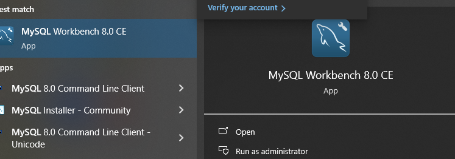
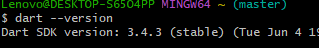
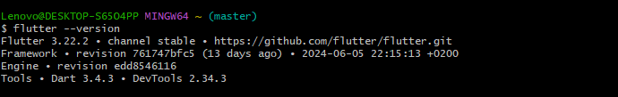

# Dev_Setup
Setup Development Environment

#Assignment: Setting Up Your Developer Environment

#Objective:
This assignment aims to familiarize you with the tools and configurations necessary to set up an efficient developer environment for software engineering projects. Completing this assignment will give you the skills required to set up a robust and productive workspace conducive to coding, debugging, version control, and collaboration.

#Tasks:

1. Select Your Operating System (OS):
   Choose an operating system that best suits your preferences and project requirements. Download and Install Windows 11. https://www.microsoft.com/software-download/windows11

   My current operating system does not allow me to upgrade to windows 11
   

2. Install a Text Editor or Integrated Development Environment (IDE):
   Select and install a text editor or IDE suitable for your programming languages and workflow. Download and Install Visual Studio Code. https://code.visualstudio.com/Download
   

3. Set Up Version Control System:
   Install Git and configure it on your local machine. Create a GitHub account for hosting your repositories. Initialize a Git repository for your project and make your first commit. https://github.com

4. Install Necessary Programming Languages and Runtimes:
  Instal Python from http://wwww.python.org programming language required for your project and install their respective compilers, interpreters, or runtimes. Ensure you have the necessary tools to build and execute your code.

5. Install Package Managers:
   If applicable, install package managers like pip (Python).

6. Configure a Database (MySQL):
   Download and install MySQL database. https://dev.mysql.com/downloads/windows/installer/5.7.html

7. Set Up Development Environments and Virtualization (Optional):
   Consider using virtualization tools like Docker or virtual machines to isolate project dependencies and ensure consistent environments across different machines.

8. Explore Extensions and Plugins:
   Explore available extensions, plugins, and add-ons for your chosen text editor or IDE to enhance functionality, such as syntax highlighting, linting, code formatting, and version control integration.

9. Document Your Setup:
    Create a comprehensive document outlining the steps you've taken to set up your developer environment. Include any configurations, customizations, or troubleshooting steps encountered during the process. 

My current device does not support installation of windows 11
1.VisualStudio CODE was a simple installation I downloaded the installer from the official website,followed the prompts for installation and launched it.In VisualStudioCode extensions were also installed namely;Black,Dart,Data Wrangler,Flutter,mplstyle,pylance,python and python debugger.
2.Setting up GITHUB :Created an account on github.com a valid email was required and a strong password and username was created.After installing Git configuuring it was the next step "git config --global user.name" "git config --global user.email" After the simple set up explore features that github has to offer such as creating  and initializing repositories,git push,git pull etc.
3.Downloaded Python via python.org,ran the installer and chose the location of the installation file and installed it.In this case there was no need to add it to my PATH environment variable as it had been added  automatically.

4.After setting up github which was accompanied by git bash and git giu and installing python a package manager 'pip' was installed.Pip allows installing of libraries,commandlinetools.Managing dependecies for projects and setting up development environments for projects.PIP was installed via the command prompt('python -m ensurepip)

5.MySQL Database installation had some configuration processes such as choosing the community version of MySQL,choosing the correct operating system,leaving some settings at default,changing some that are designated for a certain user requirement.Creating an account and a strong password was the next steps so that the installer runs.MySQL Workbench,which is a tool used in database development and management, was installed(latest version) simalarily as other installations,as simple as, downloading the file,choosing the installation location,choosing components that as a user are needed or wanted and configuring it to MySQL.

6.Other installations include:Dart which was downloaded via dart.dev,dartsdk was a compressed file which needed to be extracted and unzipped.Then to add it to the environmental variable create a path and copy its address,search for' edit environment variable',click on path,edit,add new path and paste the directory that was copied earlier and save.
 
Another installation would be Flutter which was installed via flutter.dev . 
started with creating a flutter directory,and downloaded the flutter sdk and unzipped it(extract all).Create and copy an address on the file explorer to create a path and then go to control system,search for edit environment variable and add the address to windows PATH and save.
 
When running "flutter doctor" on VisualStudioCode I received an error."VisualStudio not installed" how I overcame it is by installing visual studio(a link was provided which lead to the official website) and setting it up which resolved the issue.Android Studios was not a must to install however I installed it and it's commandlinetools with no issues encountered.
Most installations were simple and did not need drastic changes to its settings.Changes were based of specific requirements or challenges encountered during the setup.To keep the environment stable regular updates are needed.

#Deliverables:
- Document detailing the setup process with step-by-step instructions and screenshots where necessary.
- A GitHub repository containing a sample project initialized with Git and any necessary configuration files (e.g., .gitignore).
- A reflection on the challenges faced during setup and strategies employed to overcome them.

#Submission:
Submit your document and GitHub repository link through the designated platform or email to the instructor by the specified deadline.

#Evaluation Criteria:**
- Completeness and accuracy of setup documentation.
- Effectiveness of version control implementation.
- Appropriateness of tools selected for the project requirements.
- Clarity of reflection on challenges and solutions encountered.
- Adherence to submission guidelines and deadlines.

Note: Feel free to reach out for clarification or assistance with any aspect of the assignment.
